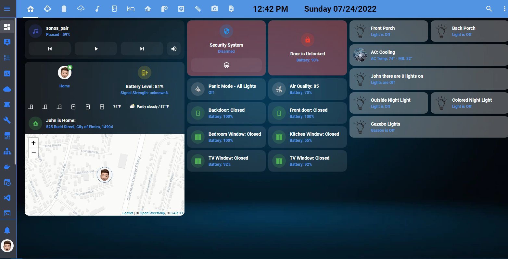

# HA-YAML

This is my entire ha yaml file.
This is how my HA views look

The js files I use:

lovelace:
  mode: yaml
  resources:
    - url: /hacsfiles/button-card/button-card.js
      type: module

    - url: /hacsfiles/simple-thermostat/simple-thermostat.js
      type: module

    - url: /hacsfiles/lovelace-thermostat-card/main.js
      type: module

    - url: /hacsfiles/mini-climate-card/mini-climate-card-bundle.js?v=1.2.7
      type: module

    - url: /hacsfiles/lovelace-card-mod/card-mod.js
      type: module

    - url: /hacsfiles/custom-ui/custom-ui.js
      type: module

    - url: /hacsfiles/lovelace-card-tools/card-tools.js
      type: module

    - url: /local/moment.js
      type: module

    - url: /hacsfiles/mini-graph-card/mini-graph-card-bundle.js
      type: module

    - url: /local/custom-ui/dark-sky-weather-card.js
      type: module

    - url: /hacsfiles/lovelace-multiple-entity-row/multiple-entity-row.js
      type: module

    - url: /hacsfiles/lovelace-clock-card/clock-card.js
      type: module

    - url: /local/custom-ui/mini-media-player-bundle.js?v=1.16.2
      type: module

    - url: /hacsfiles/battery-state-card/battery-state-card.js
      type: module

    - url: /hacsfiles/lovelace-battery-entity-row/battery-entity-row.js
      type: module

    - url: /hacsfiles/lovelace-header-cards/lovelace-header-cards.js
      type: module

    - url: /hacsfiles/custom-sonos-card/custom-sonos-card.js
      type: module

    - url: /hacsfiles/ha-navbar-position/ha-navbar-position.js
      type: module

    - url: /hacsfiles/secondaryinfo-entity-row/secondaryinfo-entity-row.js
      type: module

    - url: /hacsfiles/bar-card/bar-card.js
      type: module

    - url: /hacsfiles/lovelace-more-info-card/more-info-card.js
      type: module

    - url: /hacsfiles/surveillance-card/surveillance-card.js
      type: module

    - url: /hacsfiles/lovelace-mushroom/mushroom.js
      type: module

    - url: /hacsfiles/purifier-card/purifier-card.js
      type: module

    - url: /hacsfiles/decluttering-card/decluttering-card.js
      type: module

    - url: /hacsfiles/stack-in-card/stack-in-card.js
      type: module

    - url: /hacsfiles/refreshable-picture-card/refreshable-picture-card.js
      type: module

    - url: /hacsfiles/bom-weather-card/bom-weather-card.js
      type: module

    - url: /hacsfiles/lovelace-hourly-weather/hourly-weather.js
      type: module

